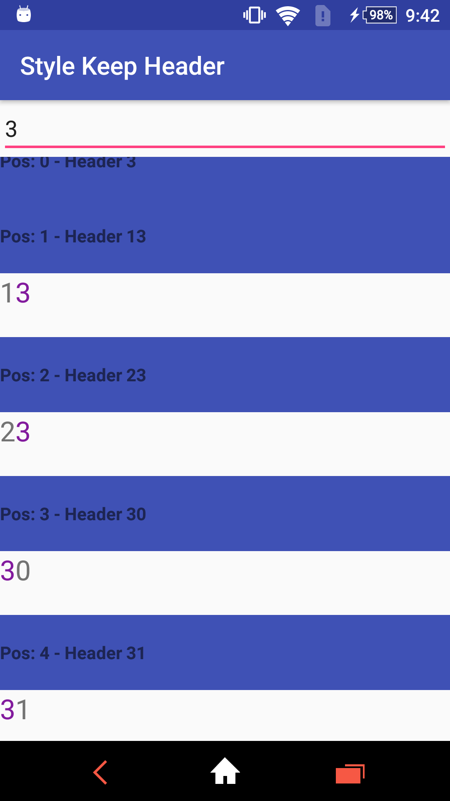

# Setup
Add it in your root build.gradle at the end of repositories:

	allprojects {
		repositories {
			...
			maven { url 'https://jitpack.io' }
		}
	}
  
Add the dependency

	dependencies {
	        compile 'com.github.nhancv:nc-android-sticky-header:v1.0'
	}

# Style Keep Header (default):
```
new StickyHeaderDecoration(this);
```


# Style NonKeep Header:
```
new StickyHeaderDecoration(this, false);
```

